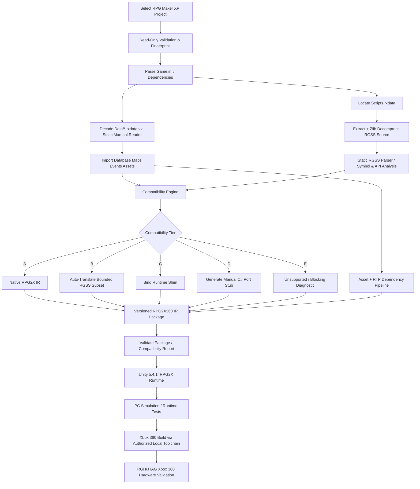

# RPG2X360 RMXP-First Workflow Diagram

## Mermaid



## ASCII

```text
                       RPG MAKER XP PROJECT
                               |
                  +------------+-------------+
                  |                          |
          Game.ini / Data                Scripts.rxdata
                  |                          |
       Static Marshal Decode         Decompress Ruby Source
                  |                          |
      DB / Maps / Events / Assets     Static RGSS Analysis
                  |                          |
                  +------------+-------------+
                               |
                    COMPATIBILITY ENGINE
                               |
         +----------+----------+----------+----------+
         |          |          |          |          |
       Tier A     Tier B     Tier C     Tier D     Tier E
     Native IR   Auto RGSS   Runtime    Manual    Unsupported
                 Subset      Shim       C# Stub   / Blocking
         |          |          |          |          |
         +----------+----------+----------+----------+
                               |
                    RPG2X360 IR PACKAGE
                               |
                    Unity 5.4.1f Runtime
                               |
                       Runtime Testing
                               |
                       Xbox 360 Build
                               |
                      Hardware Validation
```
